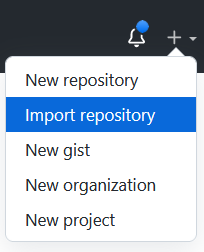

Dead Git Switch
===

Dead man's switch using github actions scheduled daily that checks if you pushed a commit/branch on github for a configurable number of day. If the switch is triggered, the script turns the repo public to share secrets or embarassing informations to encourage maintaining regular coding habits.

# Disclaimer

This project was made just for fun. I am in not way responsible for any ill advised use. Use at your own risk.

This project requires a Github Token to operate. Make sure to take correct precaution when dealing with this token as it can be used to access multiple ressources.

# How to

### Step 1 : Fork this repo.

> If you use the github fork button, you will not be able to make the repo private. Use this button only if you want to develop on this project

In order to correctly fork this repo, you will have to create a new separate repo and mirror the project to it. This is also the most secure option has only you have access/knowledge of that repo. 

Click `+` next to your username and then: Import repository

Use this repo url : `https://github.com/ncareau/dead-git-switch`

### Step 2 : Create Github Token

A github token can be created at https://github.com/settings/tokens

Under Settings -> Developer settings -> Personal access tokens

Create the token with `No Expiration` and `repo` (all) + `read:user` scopes.

### Step 3 : Configure and Test

Configure the following variables.

| Variable     | Description |
| ----------- | ----------- |
| **GH_TOKEN**      | **Required** - Github token generated in Step 2 |
| **DAYS**   | **Required** - Number of days of commit inactivity until it trigger the switch. |
| **DRY_RUN** | **Required** - Default to True. Won't commit any change until DRY_RUN is false |

### Step 4 : Test the app. 

Run your application in dry_run mode in order to check if everything runs correctly.

Look for LAST_DRY_RUN in your github actions secrets to confirm that the script runned successfully. 

Once you confirmed that the script runned once successfully, you can change `DRY_RUN` to `False` to arm the script correctly. 

### Step 5 : Add payload
    
Add the information you want to make public to this repository. You can edit this readme file in order to quickly show a glance of information. Or change it completely to add your secrets. You could add emabarassing picture to encourage maintaining regular coding habits.

You can link the payload ([Secret Payload](img/secret_payload.jpg)) or include it in this file :

